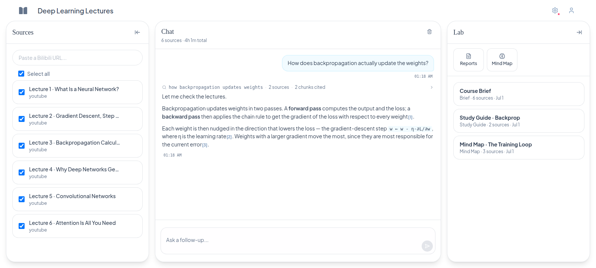
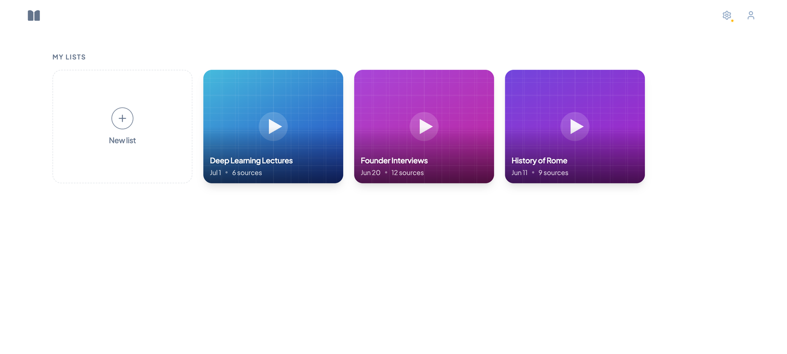
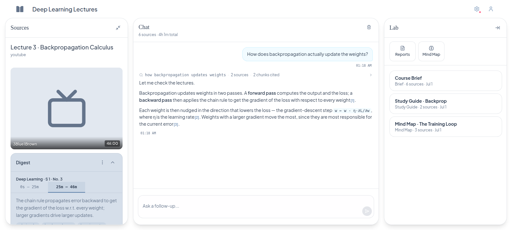
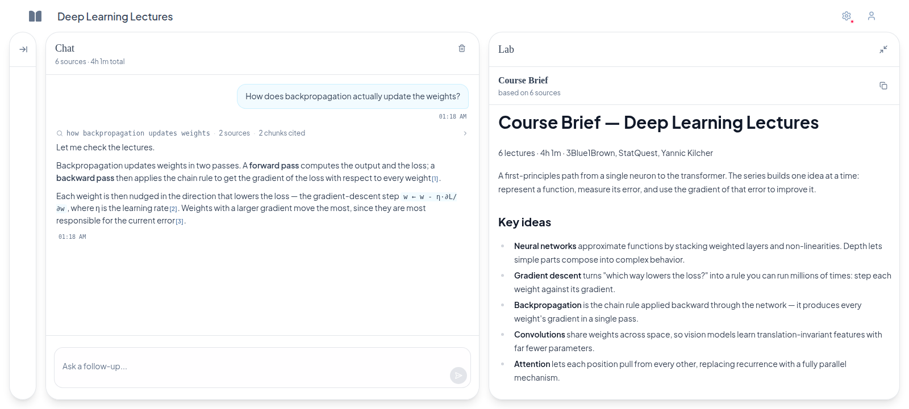
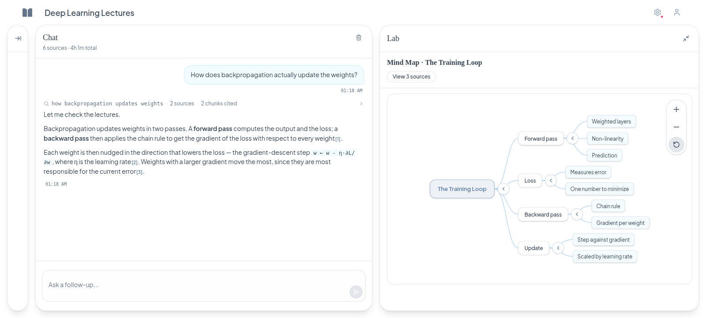

<p align="center">
  
</p>

<h1 align="center">Bibilab</h1>

<p align="center">
  A local, private <strong>NotebookLM for video</strong> — turn videos &amp; playlists
  into a searchable, citation-backed AI notebook. No cloud.
</p>

<p align="center">
  <a href="LICENSE"></a>
</p>

<p align="center">
  <b>English</b> · <a href="README.zh-CN.md">中文</a>
</p>

<p align="center">
  
</p>

<p align="center">
  <em>Turn a playlist into a private notebook, then ask questions across every transcript — answers cite their sources.</em>
</p>

<p align="center">
  
</p>

<table>
  <tr>
    <td width="50%"></td>
    <td width="50%"></td>
  </tr>
  <tr>
    <td align="center"><b>Your notebooks</b> — one card per playlist</td>
    <td align="center"><b>Every source</b> — synced transcript &amp; per-section digest</td>
  </tr>
</table>

<p align="center"><em>The Lab turns your sources into artifacts — briefs, study guides, and interactive mind maps.</em></p>

<p align="center">
  
  <br /><sub><b>Reports</b> — briefs &amp; study guides generated from your sources</sub>
</p>

<p align="center">
  
  <br /><sub><b>Mind maps</b> — explore the ideas, click a node to ask about it in chat</sub>
</p>

Transform video content into searchable, AI-assisted **private notebooks**. A
local FastAPI backend runs the full processing pipeline (download → transcribe →
punctuate → chunk → digest ∥ embed) and a React + TypeScript SPA is the user
surface. Single-user, single-machine, no cloud.

> The repo carries three packages. Their own guides (linked below) are
> authoritative; this README is the entry point and the place to find
> cross-package setup.
>
> | Path | Role | Own guide |
> |---|---|---|
> | `backend/` | FastAPI pipeline, SQLite, ChromaDB, FastAPI serves the SPA in prod | [`backend/CLAUDE.md`](backend/CLAUDE.md) |
> | `web/` | React + TypeScript SPA (Vite, Tailwind) | [`web/CLAUDE.md`](web/CLAUDE.md) |
> | `eval/` | RAG answer evaluation framework (separate `uv` package) | [`eval/CLAUDE.md`](eval/CLAUDE.md) / [`eval/README.md`](eval/README.md) |
> | `docs/` | Architecture, citation system, RAG intro | `docs/citation_system.md`, `docs/RAG简介.md`, `docs/roadmap.md` |

---

## Bibilab vs Google NotebookLM

Same "chat with your sources" idea, built for people who want it **local, open, and
video-native** instead of cloud-hosted. NotebookLM is a polished managed product;
Bibilab trades that polish for full ownership of your data and models.

|                                                            | Bibilab | NotebookLM |
| ---------------------------------------------------------- | :-----: | :--------: |
| Runs fully local, no account                               |    ✓    |     ✗      |
| Self-hosted / OpenAI-compatible models (Ollama, LM Studio) |    ✓    |     ✗      |
| Open source                                                |    ✓    |     ✗      |
| Video sources: Bilibili · YouTube · TikTok                 |    ✓    | YouTube only |
| Speaker-attributed transcripts                             |    ✓    |     —      |
| Inline citations back to the source                        |    ✓    |     ✓      |

## What it does

For each ingested video, Bibilab produces:

- A punctuated, speaker-attributed transcript
- **Sections** — bounded sub-source spans (token-quantized, target ~12 000 tokens
  per section, range [7 200, 16 800]); short videos are one section. Per-section
  summary + keywords live on the `sections` table; the source row carries
  **facets** only (series, episode, season).
- Per-section chunks (Chinese target 800 tokens, English 300) suitable for hybrid
  vector + BM25 retrieval.
- A per-list chat with **section-grained `[N]` citations**: the LLM dispatches
  `find_passages` (recall-biased locator) or `read_section(section_id="[N]")`
  (bounded verbatim read of one section) mid-stream and answers grounded in
  transcript passages, click-to-seek back to the cited section in the source
  viewer.

Storage is per-user under `~/.bibilab/` (override with `BIBILAB_HOME`):
SQLite (`bibilab.db`) for everything structured, ChromaDB (`chroma/`) for
vector index, a `downloads/` scratch dir, a `models/` cache for the local ASR /
embedding / reranker models, and `artifacts/{id}.md` for generated artifact
content.

---

## Requirements

| Tool | Version | Why |
|---|---|---|
| Python | ≥ 3.12 | `backend` and `eval` |
| Node | ≥ 20 | `web` |
| [`uv`](https://docs.astral.sh/uv/) | latest | Python package + venv manager |
| FFmpeg | system | Audio extraction (`ffmpeg-python` shells out) |
| `aria2` | system | Multi-connection downloader (`apt install aria2` / `brew install aria2`); bounds per-IP throttle tail via yt-dlp's `external_downloader` |
| `yt-dlp` | auto-installed via `uv` (`curl-cffi` extra for TikTok TLS impersonation) | Bilibili / YouTube / TikTok adapters |

> CUDA is optional. The default ASR / embedding / reranker models run on CPU;
> GPU acceleration is a one-line config change (`transcription.device=cuda`).

---

## Quick start

```bash
# 1. Clone
git clone <repo-url> bibilab && cd bibilab

# 2. Backend
cd backend
uv sync --dev                     # creates .venv, installs everything (cpu torch by default)
# On an NVIDIA box, for GPU transcription: uv sync --no-default-groups --group dev --group cuda
uv run python -m bibilab.main     # serves API on :8765 + SPA in prod
# In dev, run the SPA separately — see step 3.
cd ..

# 3. Web (dev mode — picks up HMR)
cd web
npm install
npm run dev                       # Vite on :5173, proxies /api & /proxy → :8765
```

Open `http://localhost:5173` in dev mode, or `http://localhost:8765` if you ran
the built SPA via `npm run build` first and let the backend serve it.

The first run creates `~/.bibilab/` with an empty SQLite DB, a config file, and
empty `chroma/` / `models/` / `downloads/` directories. The local models
(SenseVoice / Whisper, ONNX MiniLM, BGE reranker) are downloaded lazily on
first use — expect ~1–3 GB the first time you ingest a video.

### Docker (one-click)

Build and run everything in a container — no local Python/Node setup.

**Prerequisites:** Docker (with Compose). For GPU-accelerated transcription you
need the NVIDIA driver plus GPU-enabled Docker — **Docker Desktop (WSL2 backend)
has this built in**, while a native Docker Engine needs the
[NVIDIA Container Toolkit](https://docs.nvidia.com/datacenter/cloud-native/container-toolkit/latest/install-guide.html).
For an **AMD GPU**, install the host `amdgpu`/ROCm kernel driver and make sure your
user is in the `render`/`video` groups — `install.sh` wires the container device
flags but cannot install host drivers. Without GPU support (or on non-NVIDIA/AMD
hosts) the container runs on CPU.

```bash
git clone <repo-url> bibilab && cd bibilab
./install.sh        # detects GPU once, builds the matching image, starts the container
```

Open `http://localhost:8765`. `install.sh` probes for working GPU passthrough and
picks the `cpu`, `cuda`, or `rocm` torch variant automatically — GPU only accelerates
ASR transcription, so the CPU image is fully functional, just slower to transcribe.

| Host | Variant |
|---|---|
| NVIDIA + GPU-enabled Docker (Docker Desktop WSL2, or Linux + Toolkit) | `cuda` — GPU transcription |
| AMD + host ROCm driver (Linux, `rocminfo` works) | `rocm` — GPU transcription |
| No GPU, macOS, Intel GPU | `cpu` — everything on CPU |
| Windows native (no WSL) | run `install.sh` from WSL/Git Bash; no GPU passthrough |

A wrong `cuda` guess can't crash you — the app clamps back to CPU at runtime if the
GPU isn't really there. If your AMD card isn't on ROCm's official support list (most
consumer Radeon cards), set `HSA_OVERRIDE_GFX_VERSION` in `.env` to the nearest
supported arch (e.g. `11.0.0` for RDNA3) before re-running `install.sh`.

Data lives in `~/.bibilab` on the host (bind-mounted to `/data`), **shared with a
native install** — the same DB, models, and config. The container runs as your
host user, so files stay yours. To update, re-run `./install.sh`.

### Pre-commit hooks

```bash
pip install pre-commit
pre-commit install                 # one-time
```

Enforces `ruff check` / `ruff format` on the backend and trailing whitespace
globally.

---

## Configuration

Config lives at `~/.bibilab/config.json` (created on first run). The full schema:

```jsonc
{
  "accounts": { "bilibili": { "cookie": "", "username": "", "avatar_url": "" } },
  "ai": {
    "protocol": "openai|anthropic",
    "model": "",
    "api_key": "",
    "base_url": null,
    "output_language": "ui",
    "context_window": 128000,
    "max_output_tokens": 16384
  },
  "transcription": {
    "model": "sensevoice-small|large-v3",
    "device": "cuda|cpu",
    "language": "auto"
  },
  "backend": { "port": 8765, "max_concurrent_jobs": 1, "cors_origins": ["*"] },
  "rag": {
    "max_distance": 0.8,
    "reranking_enabled": true,
    "hybrid_enabled": true,
    "debug_prompts": false
  }
}
```

- **`ai.api_key` + `ai.model`** — required to ingest / chat. The backend talks
  to any OpenAI- or Anthropic-protocol endpoint via `AsyncOpenAI` /
  `AsyncAnthropic`. `base_url` lets you point at a local proxy / Ollama / vLLM.
- **`transcription.model`** — `sensevoice-small` (Chinese, fast) or `large-v3`
  (Whisper, multilingual). The model is downloaded on first ingest.
- **`accounts.bilibili.cookie`** — needed for some Bilibili videos (403 → job
  ends in `needs_auth`). Use the in-app QR login under `/settings`, or paste a
  cookie string from your browser.
- **`rag.debug_prompts`** — when true, the backend writes one JSON per chat
  turn to `~/.bibilab/debug/{message_id}.json`; the UI shows a `</>` icon on
  those assistant bubbles that opens a prompt-trace drawer. Off by default.

The CLI-friendly way to set config is the FastAPI endpoints; see
[`backend/CLAUDE.md`](backend/CLAUDE.md) for the full route map.

---

## Using the app

1. **Sign in / connect an account** — open `/settings`. For Bilibili, click
   "QR login" and scan with the app; the cookie is saved to `config.json`.
2. **Create a list** — lists are top-level notebooks. Hit "New list" on the
   home grid.
3. **Ingest videos** — paste a Bilibili / YouTube / TikTok URL on the list
   detail page. Bilibili: single & multi-part videos, collections, private
   favorites (cookie login); YouTube: single videos & public playlists (no
   login); TikTok: single videos incl. share short-links & public collections
   (no login; best-effort — TikTok extraction breaks periodically upstream,
   upgrading yt-dlp usually fixes it).
   The pipeline runs in the background:
   `download → audio → transcribe → punctuate → derive_sections → chunk
    (per-section) → digest ∥ embed → write_source + write_transcript_segments
    + write_sections (atomic)`. Watch progress on the **Jobs** indicator.
4. **Ask questions** — switch to the **Chat** tab. The LLM dispatches tools
   mid-stream:
   - `find_passages(query, sequence_number?, season_number?)` — recall-biased
     locator; returns the top-8 chunks grouped per **section** under
     `===== [N] "title" · Section M (mm:ss–mm:ss) =====` fences, with
     speaker-turn reconstruction. If you pass a facet (e.g.
     `sequence_number=3`), it returns the full **section outline** for the
     matched source(s) — one `[N]` per section, summary only, non-citable
     until you drill.
   - `read_section(section_id="[N]")` — bounded verbatim read of one section
     by citation index. Use when `find_passages` showed a section is on-topic
     but the fragments miss the specific thing asked.
   - On facet zero-match (or facet-DB error) the tool fail-opens to the full
     pool and tags `facet_scope.no_match=true` so the LLM states the
     degraded scope before answering.
5. **Drill into sources** — the source-detail viewer renders N section
   sub-blocks (one per section). Citation chips in chat open the source and
   select the cited section's tab.

For the RAG two-tool surface in detail (and why this design is
gateless, two-tool, section-grained), see
[`docs/citation_system.md`](docs/citation_system.md) and
[`docs/RAG简介.md`](docs/RAG简介.md) (Chinese, the original design writeup).

---

## Development workflow

### Run all three test suites

```bash
# Backend
cd backend
uv run pytest                       # full suite (integration tests included)
uv run pytest -m "not integration"  # fast unit lane

# Web
cd ../web
npm test                            # vitest
npm run lint                        # tsc --noEmit

# Eval
cd ../eval
uv run pytest
```

### Layout (one tree per package)

- `backend/src/bibilab/` — `routers/`, `pipeline/` (one file per stage),
  `models/`, `adapters/`, `db.py`, `worker.py`, `config.py`, `cleanup.py`.
  See [`backend/CLAUDE.md`](backend/CLAUDE.md) for the full tree, database
  schema, pipeline stages, and the chat execution flow.
- `web/src/` — `components/` (ui primitive, auth, debug, lists, lab, hooks,
  jobs, layout, settings), `pages/`, `lib/` (api client, types, constants,
  i18n, chat utils), `app/`, `test/`. See [`web/CLAUDE.md`](web/CLAUDE.md).
- `eval/src/eval/` — `cli.py` (entry), `models.py`, `config.py`, `generate.py`,
  `tui.py`, `runner.py`, `grader.py`, `reporter.py`, `dashboard.py`,
  `storage.py`. See [`eval/CLAUDE.md`](eval/CLAUDE.md).

### Commit & PR conventions

Commit messages: `"<type> | <scope> | #<issue> <description>"`. Type is
`feat | fix | refactor | chore | docs`. PR titles follow the same format
(prefix with `#<issue>` when applicable). Branch
first — never commit directly to `master`.

When amending a fix to an unpushed commit, use
`git push --force-with-lease=<branch>:<expected-sha>` (pinned) rather than
plain `--force`, to avoid clobbering work pushed between your fetch and your
push.

### Home isolation in tests

Every backend test sets `BIBILAB_HOME` via the `tmp_bibilab_home` fixture —
one env seam that `bibilab_home()` honors, so tests get a per-run temp
directory without per-module patching. SQLite, Chroma, and the model cache
all respect it.

### LLM mocking

Tests that touch an LLM seam should use the conftest fixtures
`mock_stream_llm` (chat) and `mock_call_llm` (digest / chat_summary /
worker). Configure with `.return_value` / `.side_effect`; do not hand-roll
`patch("...stream_llm")` per test. Integration tests that hit real SQLite /
Chroma are marked with module-level `pytestmark =
pytest.mark.integration` and excluded from `-m "not integration"`.

---

## Project-specific patterns (don't break these)

These are the load-bearing decisions a fresh contributor is most likely to
violate by accident. The reasoning lives in [`CLAUDE.md`](CLAUDE.md) — the
TL;DRs here are for skim-readers.

- **No `/api` prefix on the FastAPI side.** Routes are mounted at root;
  `web/vite.config.ts` rewrites `/api/*` → `/*` when proxying to `:8765` in
  dev.
- **No source-level `summary` / `keywords` columns.** They're gone (post-#465).
  The sole digest store is the `sections` table.
- **`db.py` is SQL only.** No status mapping, no business logic. Domain
  derivation lives in routers / service functions (status mapping was
  extracted to `video_status.py`).
- **Section ID is a string in the LLM-facing surface, int internally.** The
  backend serializes the integer `sections.id` as a JSON number; the SSE
  ingestion path coerces to string so strict-equality matches (citation jump,
  history reload) work. Don't refactor away the coercion without auditing
  every ingestion boundary.
- **One `[N]` per section**, not per source. `CitationRegistryEntry` is keyed
  by `section_id`. Outline-only sections are `citable=False` until
  `read_section` drills them.
- **Cross-section order is rerank-first-hit; within a section, fragments
  render chronologically (segment order, not rerank order) with a `[…]` gap
  marker between non-seg-adjacent fragments.** Rerank is the ordering
  authority across sections, but inside a fence the LLM reads the section's
  own excerpts in spoken order.
- **No migrations in code.** Schema changes are one-shot `sqlite3` CLI
  invocations; don't edit `bootstrap_db` to add migrations.
- **No external references in code comments.** No `(#441)`, no
  `docs/specs/...` paths, no event dates, no git log refs. Allowed: intra-repo
  cross-refs, `# noqa:`, design rationale in plain prose. Memory files are the
  one place you can reference git commits / PR-#s.
- **One-shot scripts (migrations, backfills, fixups) get deleted after a
  verified run.** They are untracked tooling, not seams.

---

## Contributing

1. **Pick an issue** — see the GitHub issues list. The roadmap of
   open questions is in [`docs/roadmap.md`](docs/roadmap.md).
2. **Branch off `master`** — `git checkout -b <type>/<scope>-<short-desc>`.
3. **Read the relevant `CLAUDE.md`** before touching code — the
   `Code Health Rules` (no dead code, no magic strings, no duplicated logic,
   no business logic in the data layer, scope discipline, verify before
   commit) apply to every change.
4. **Run `/simplify`** after each implementation phase.
5. **Verify before commit** — `uv run pytest` (backend) and `npm test &&
   npm run lint` (web) must pass.
6. **Open a PR.** Reference the issue number in the title and body. Squash-
   merge when it lands; the issue will close automatically.

For deeper docs that the README doesn't duplicate, see:

- [`docs/citation_system.md`](docs/citation_system.md) — the section-grained
  citation system in full
- [`docs/RAG简介.md`](docs/RAG简介.md) — Chinese-language design writeup
  (ingest + query stages, two-tool surface, FTS-vs-vector rationale)
- [`docs/roadmap.md`](docs/roadmap.md) — open questions by version
- [`backend/CLAUDE.md`](backend/CLAUDE.md) — backend conventions, schema,
  pipeline, chat execution
- [`web/CLAUDE.md`](web/CLAUDE.md) — frontend conventions, RAG metadata shape
- [`eval/CLAUDE.md`](eval/CLAUDE.md) / [`eval/README.md`](eval/README.md) —
  the eval framework

For agent-specific context (memory, feedback) that this README deliberately
omits, see `~/.claude/projects/.../memory/MEMORY.md` and the
[`CLAUDE.md`](CLAUDE.md) at the project root.

## License

[MIT](LICENSE) © AmosChenZixuan
